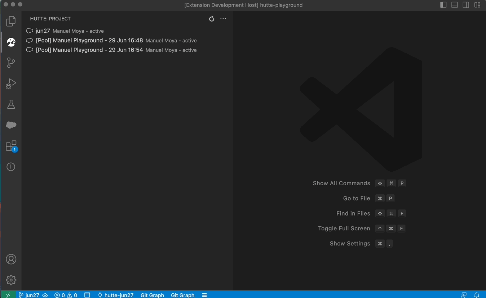

# VSCode Hutte Extension

Allows you to use Hutte capabilities from your VSCode application, without having to navigate to Hutte UI. Development can be done from the beginning (creating of scratch orgs) to the end all from VSCode.

## Pre-requisites

- [SFDX CLI](https://developer.salesforce.com/tools/sfdxcli)
- [Hutte CLI](https://github.com/hutte-io/cli), check [this article](https://docs.hutte.io/en/articles/6836945-hutte-sfdx-plugin) for more information. Make sure the version of Hutte plugin is equal or bigger than `1.1.0`.
  - Upgrading Hutte CLI:
    - To check the current version of Hutte plugin, use `sfdx plugins:inspect hutte`
    - To upgrade to 1.1.0, use `sfdx plugins:install hutte@1.1.0`
- [Hutte account](https://hutte.io/trails/signup/)

## Features

- Signup into Hutte
- Login into Hutte
- Retrieve Active Orgs from the Hutte project linked to the repository
 

- Set as Default an Org from the Hutte project list.
  
  Note that the default behaviour of `Hutte.yml` will be taken into account. This set default hutte org logic will perform the same logic as Hutte SFDX Plugin's `sfdx hutte:org:authorize` command.

- Activate a new Org from the Pool
  

- Open an Org on the Hutte UI (deeplink)
   

## Release Notes

### 1.0.0

First version of the extension

## Feedback and Bug Reports

Your support and feedback are instrumental in shaping the future of this Plugin. Please reach out to support@hutte.io, or reach us through the chat on hutte.io or inside app2.hutte.io if you encounter issues or have suggestions for improvement.

**Enjoy!**
